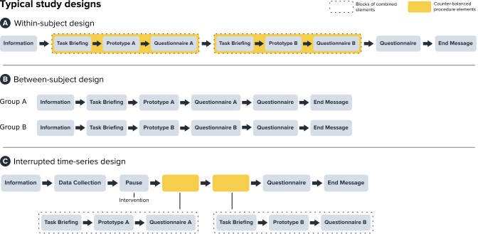
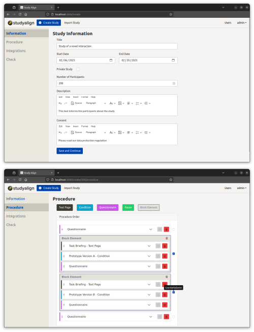
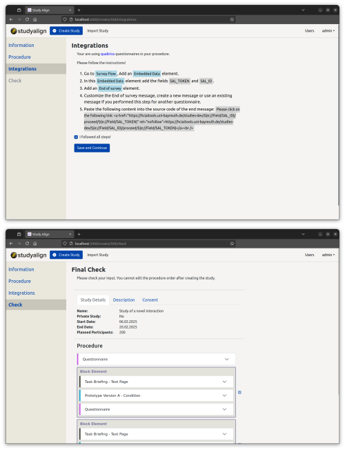
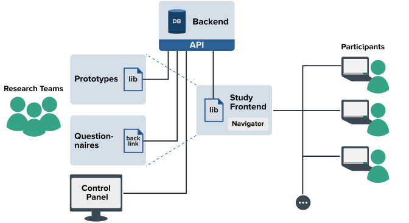

# StudyAlign Documentation

StudyAlign is an open-source software system for setting up online user studies to evaluate web prototypes, such as interactive prototypes with AI features. It simplifies implementing experiment procedures, integration of questionnaires, and data logging. It has a focus on studies in the field of Human-Computer Interaction and human-AI interaction studies
since these studies have been prototyped with web technologies lately.

- Key Features
- Typical Study Designs
- Screenshots
- Software Parts
- Setting up the System
- Preparing and Creating a Study
- Philosophy

StudyAlign streamlines HCI online studies and has enabled several studies; see "Studies Enabled by StudyAlign".

You can find detailed information about the system in our paper `StudyAlign: A Software System for Conducting Web-Based
User Studies with Functional Interactive Prototypes` arXiv:  ACM DL: https://doi.org/10.1145/3733053

## Key Features

StudyAlign offers the following key features:

- **UI for creating web-based studies** The Control Panel supports setting up and managing web-based studies and allows for various study designs. Researchers can edit procedures interactively with a setup wizard and select specific parts easily for counter-balancing.
- **Library for integrating prototypes** The Library can be included in existing prototypes and enables the integration into StudyAlign, e.g. to the logging of browser events
- **A frontend for participants** The Study Frontend guides the participants through studies end to end and controls the user flow so participants can only proceed one step at a time.
- **Interaction logging** The system persists log data in the Backend. It supports logging native browser events, like mouse, keyboard, and touch events. Furthermore, it allows the storage of custom data objects.
  Methods for data logging are provided in the Library and can be integrated by researchers as "one-liners", to enable easy data logging from inside prototypes.
- **Sharing of studies** StudyAlign allows the import and export of studies. That way, study schemes can be shared easily as material for papers to support future research.
- **Keeping track of studies** In the long run, research teams can view a history of existing studies and reuse and evolve their designs.

## Typical Study Designs

These are examples of typical study designs that research teams can implement with StudyAlign (but are not limited to)

*This figure shows typical study designs that can be implemented with StudyAlign. The system supports within-subject, between-subject, and interrupted time-series designs. Example A shows a within-subject design: The task briefings, prototypes, and questionnaires in this example are combined into one "block" element. Such blocks of elements are then counterbalanced. Example B shows a between-subject design: A separate study is created for each group. It is possible to duplicate an existing study, which eases the creation of between-subject designs. Example C shows an interrupted time-series design: The procedure is similar to a within-subject design but with an initial data collection step and an extended pause (e.g. multiple days), for example, to give researchers the time to create an intervention based on the collected data. This intervention then influences the prototypes in the remaining study procedure.*

## Frontends

### Admin Frontend

The screenshots show the Control Panel UI for setting up experiments. The setup wizard asks for general
information and offers an interactive view supporting researchers in setting up a study.

### Study Frontend

The screenshot shows the UI of the study frontend, particularly a task briefing that has been implemented with a text page element. The text page displays a title and text instructions. The Navigator UI at the bottom of the screenshot allows participants to go ahead with the procedure by clicking on the "next" button in the bottom right.

## Software Parts

StudyAlign builds on four software parts.

1. a study frontend for participants
2. a control panel to manage studies
3. a library to integrate prototypes
4. a backend server for persisting log data, and offering the system's API

*Overview of the software system StudyAlign. The main components are the Backend, Control Panel, Study Frontend, and Library. The Backend is the system's core since it holds the logic and persists data in a database. Researchers use the Control Panel to set up and manage studies. The Study Frontend controls the experiment procedure and serves the study to the participants' devices.
It embeds prototypes and questionnaires (external services) and displays them to participants. Questionnaires use a callback function to work with the API.
The Library is the counterpart to the Backend's API and is used in the prototype for interaction logging and in the Study Frontend to control the procedure.*

## Setting up the System

- Deploy the backend server
- Deploy the study frontend
- Deploy the admin panel

## Preparing and Creating a Study

- Integrate the Library
  - into your React app
    - place the library into your project
    - implement a useLogger hook to define the events
    - call the useLogger hook in your App.js and make it available to all components through a LoggerContext
    - in child components, get the logger through the LoggerContext and log the events
    - **see the react-example directory for an example implementation**
  - into your vanilla JavaScript projects
    - integrate the bundled library
    - bind events to UI elements
    - **see the basic-example directory for an example implementation**
- Create an online study
- Integrate questionnaires from external services (e.g. Qualtrics)
- Share links with participants

## Study Examples for Import

We have generated study schemas you can import into StudyAlign, for example, within and between subject designs.

See the schema-examples directory to find the JSON files.

## Philosophy

StudyAlign is part of our vision to advance the methodological aspects of web-based HCI research.

The initial motivation to start the project comes from our experience: we re-implemented experiment logic and logging infrastructure several times across various projects. When we compared our experience to related work, we found similarities: researchers applied the same methods but gave little or no insight into how they implemented them. These researchers supposedly also spend time on the development of software and integration of online services surrounding their research.

We identified this as a challenge to provide a foundation for implementing methods in web-based studies.

StudyAlign allows researchers to focus on designing, developing, and studying interactions since the research methods implemented in our system can be reused across studies. Moreover, we support the vision of allowing researchers to share their study design and enable replication.

## Studies Enabled by StudyAlign

The following studies have been enabled by StudyAlign and are published at major HCI venues:

- Exploring Mobile Touch Interaction with Large Language Models [CHI25] https://dl.acm.org/doi/10.1145/3706598.3713554
- Content-Driven Local Response: Supporting Sentence-Level and Message-Level Mobile Email Replies With and Without AI [CHI25] https://dl.acm.org/doi/full/10.1145/3706598.3713890
- Writer-Defined AI Personas for On-Demand Feedback Generation [CHI24] https://dl.acm.org/doi/10.1145/3613904.3642406
- The AI Ghostwriter Effect: When Users do not Perceive Ownership of AI-Generated Text but Self-Declare as Authors [ToCHI] https://dl.acm.org/doi/10.1145/3637875
- Beyond Text Generation: Supporting Writers with Continuous Automatic Text Summaries [UIST22] https://dl.acm.org/doi/10.1145/3526113.3545672
- Choice Over Control: How Users Write with Large Language Models using Diegetic and Non-Diegetic Prompting [CHI23] https://dl.acm.org/doi/10.1145/3544548.3580969

